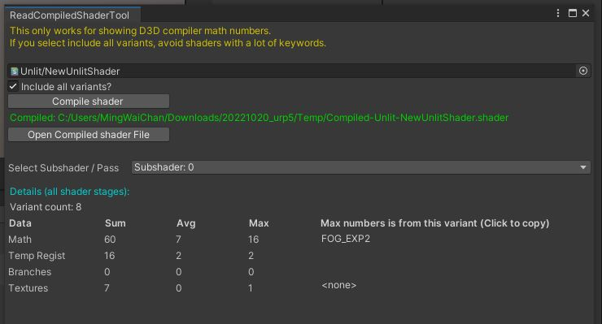

# Read Compiled Shader Tool
Unity 2022.2+\
This tool reads compiled shader code (D3D only!) and put counts and summary numbers on the tool.
\

### How to use:
1. Add the scripts to an Editor folder
2. Top > Windows > ReadCompiledShaderTool
3. See steps on the tool.
\
\
