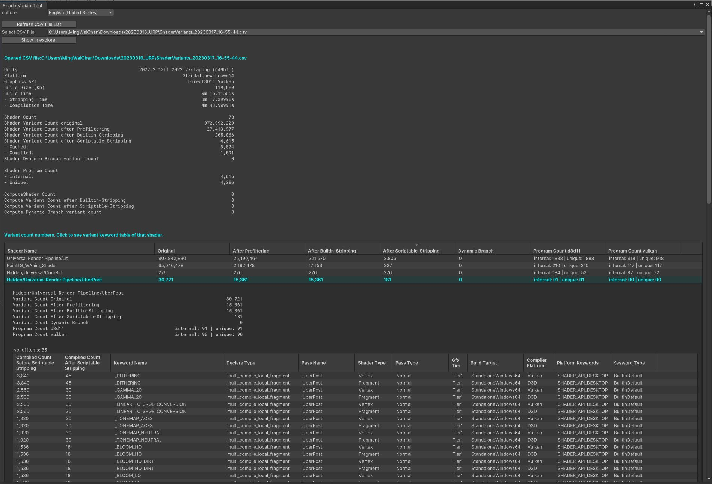

# ShaderVariantTool
This tool lists out all shader keywords and variant counts that are being included in player build. \
i.e. If a shader keyword is being stripped, you won't see the keyword on the list.
\
\
Unity 2022.1.0a14+ \
If you need older Unity versions please check out to branches \

### How to use:
1. Add the scripts to an Editor folder \
2. Make a player build
3. Top > Windows > ShaderVariantTool
\
\

