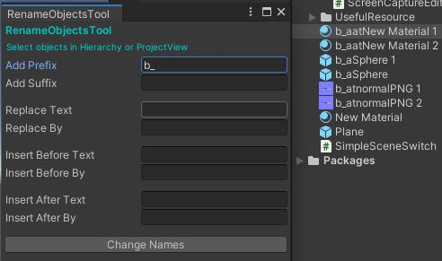
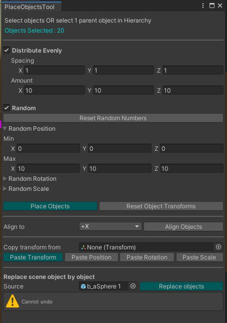
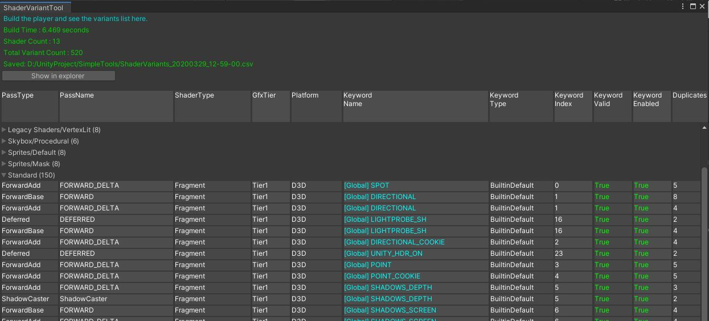

# SimpleTools

Some tools I made for making my daily work easier. \
Unity version : 2021.2+ on master. For older versions pleaase see branches.

## Editor

| Script | Image | Description |
| --- | - | --- |
| `EditorTime` |  | Let's say you leave it open before you close Unity. Then you reopen Unity, you will see how much time the Editor spent loading up the editor.. same usage for checking asset loading time, scene loading time etc. |
| `ScreenCaptureEditorTool` |  | Just make a screen capture |
| `RenameObjectsTool` |  | Rename scene objects or project files |
| `PlaceObjectsTool` |  | Distribute / Align / Random / CopyPaste the GameObjects transform, Replace objects |
| `ShaderVariantTool` |  | See what shader variants are included in the build. [See details here](Assets/Editor/ShaderVariantTool/) |
| `AnimationPreviewTool` |  | Preview any animation that exists on any scene GameObjects |
| `AsyncShaderCompilingTool` |  | Select materials and compile the shader passes |

## Runtime

| Script | Image | Description |
| --- | - | --- |
| `SimpleSceneSwitch` |  | Make an empty scene, add to BuildSettings, drag this script to any object |
| `xxxxxx` |  | xxxxx |

