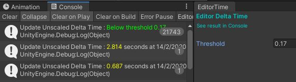
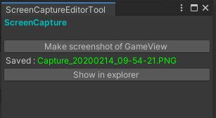
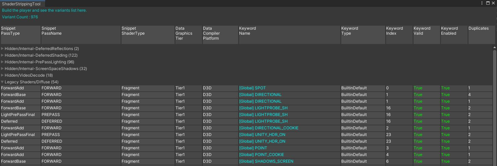
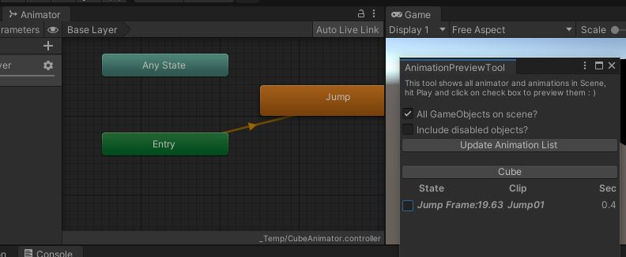
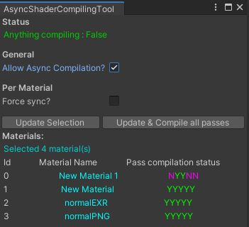
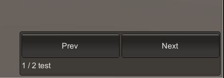

# SimpleTools

Some tools I made that helped my daily work.

Unity version : 2019.3+, but should work in older versions with minor code fix

## Editor

| Script | Image | Description |
| --- | - | --- |
| `EditorTime` |  | Let's say you leave it open before you close Unity. Then you reopen Unity, you will see how much time the Editor spent loading up the editor.. same usage for checking asset loading time, scene loading time etc. |
| `ScreenCaptureEditorTool` |  | Just make a screen capture |
| `ShaderStrippingTool` |  | See what shader variants are included in the build |
| `AnimationPreviewTool` |  | Preview any animation that exists on any scene GameObjects |
| `AsyncShaderCompilingTool` |  | Select materials and compile the shader passes |

## Runtime

| Script | Image | Description |
| --- | - | --- |
| `SimpleSceneSwitch` |  | Make an empty scene, add to BuildSettings, drag this script to any object |
| `xxxxxx` |  | xxxxx |

